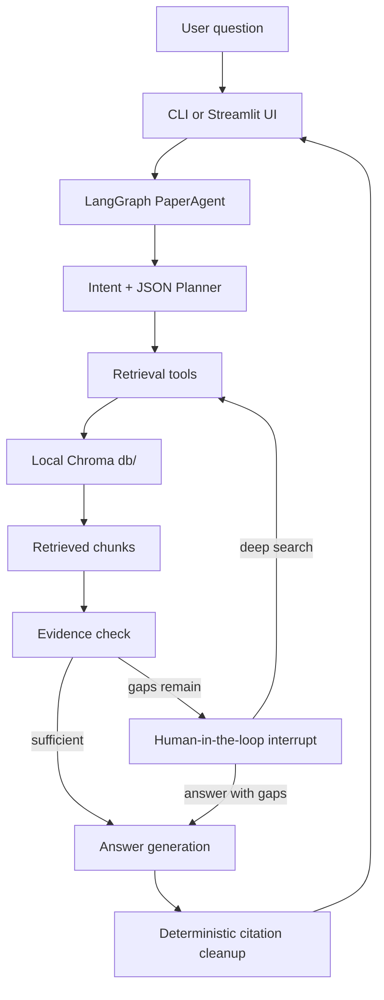

# Architecture

This project is organized around a local RAG loop with explicit evidence checks before answer generation.

## Main Components

- `ingest.py`: reads PDFs from `data/`, splits text, embeds chunks, and writes Chroma under `db/`.
- `agent_tools.py`: exposes retrieval, multi-query search, neighbor chunk lookup, and paper listing.
- `paper_agent.py`: owns intent recognition, planning, tool execution, evidence checks, HITL, and final answer formatting.
- `ui_agent_adapter.py`: converts Agent state into Streamlit-safe UI results.
- `streamlit_app.py`: single-page demo for interactive use.
- `eval/`: frozen offline cases and layered evaluation runners.

## Local-Only State

- `data/`: user-provided PDFs.
- `db/`: Chroma vector database.
- `runtime/`: SQLite checkpointer and runtime logs.
- `eval/results/`: generated evaluation reports.

These folders are ignored by git.

## Retrieval Scope

The Agent first tries to resolve explicit paper mentions from the user question. If a user asks across the current paper library, the planner's accidental single-paper source is removed and retrieval runs over the full catalog. Short aliases such as `RAG` are matched with ASCII token boundaries so words such as `drag` or `bragging` are not treated as paper names.

## Citation Handling

The LLM is asked to cite evidence with `[n]`, but the final source list is generated by Python. Existing model-generated source lists are stripped, invalid references are removed, used sources are compacted in first-appearance order, and the final body/source numbering is validated deterministically.
